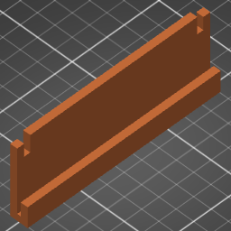

# Camera Stand

This repository hosts the development of a 3D model for a 3D printed part that
is used to mount my camera to use as a webcam behind my monitor.

## Status & Goal

- [x] Design a part that can sit snugly on the edge of the VESA mount plate
- [ ] Design a spacer that brings the vertical flat up to the camera level
- [ ] Design a recess in the shape of the camera body + the dummy battery plug

The part is a work in progress and I am iterating on the design as of current.

My goal is to design a shape that can sit on the top edge of the plate of the
VESA mount I use to mount my screen to the wall. The mount is made of two parts
that slide together and are secured together with a pair of screws. I want to
use the thickness and the arc of the edge as well as the screws to sit the part
on the VESA mount and prevent it from shifting or moving in any direction but
upwards (so that I can remove it), the rest will be secured in place by the
geometry of the spots of the mount touching the part and gravity.

Once I have this level surface behind my monitor, I will carve out a recess into
it in the shape of the bottom side of my camera and sit the camera in it so that
it is exactly pointed and usable as a webcam for me.

## Process & Files

I use OpenSCAD to design the part. I split my screen into VS Code on the left
and OpenSCAD on the right. OpenSCAD is configured to hide the editor and with
this setting on, it will automatically refresh whenever the source file is
changed in VS Code. In VS Code, I use the OpenSCAD extension for VS Code for
syntax highlighting and auto-complete.

Once I am happy with the current iteration, I render the file out to an SLT in
OpenSCAD (configured to put out ASCII STL by default) and drag it into a new
project in PrusaSlicer. Next, I orient it for the speed of printing and less so
for the strength of the resulting part (since it is just an iteration for now)
and slice it there. Once sliced, I save the PrusaSlicer project and the GCode.

Since PrusaSlicer projects are 3MF files which are binary (they are [OPC] ZIP
archives of several files), I use a hand-made script that I run after I have
saved the 3MF file to extract it into a directory by the same name to help diff.

[OPC]: https://en.wikipedia.org/wiki/Open_Packaging_Conventions

- `3mf-zip-dir.sh` is the script used to extract 3MF into a directory
- `camera-stand.gcode` is the GCode generated by PrusaSlicer fo my Prusa MK3S
- `camera-stand.scad` is the source code authored by me
- `camera-stand.stl` is the ASCII STL rendered out by OpenSCAD
- `camera-stand.3mf` is the directory where `./3mf-zip-dir` extracts PrusaSlicer
  project file by the same name (it is an OPC ZIP binary not fit for versioning)
