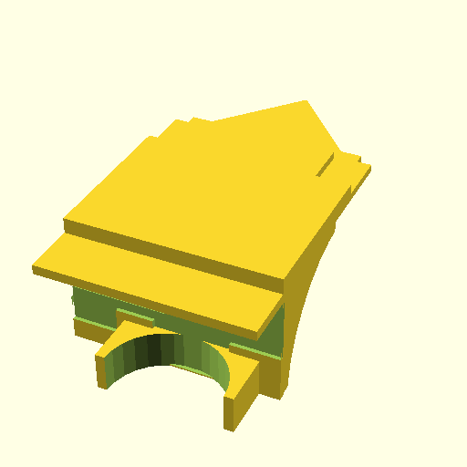

# Camera Stand

This repository hosts the development of a 3D model for a 3D printed part that
is used to mount my camera to use as a webcam behind my monitor.

## Status & Goal

This part should be complete now provided the test print fits.

The goal of this part is to be a mount that fits into the VESA mount of my
monitor and extends a flat platform onto which my camera can sit. The platform
has hole for the dummy battery power plug as well as a recess in the shape of
the camera's body so that the camera doesn't shift away from the central point
when I turn it on and off. The recess/track that fits the camera's body in the
flat of the platform also extends to make room for the camera's grip handle and
the lens which both extend to contour of the camera as projected on the surface.

## Process & Files

Note: this process is implemented in [`slice.sh`](slice.sh). The simplified
process now is to open OpenSCAD and VS Code side by side, make changes in VS
Code and see them reflect in OpenSCAD and on each iteration I am happy with run
`./slice.sh` which generates STL, slices it to GCode and export a 3MF directory
of the PrusaSlicer project file as well.

I use OpenSCAD to design the part. I split my screen into VS Code on the left
and OpenSCAD on the right. OpenSCAD is configured to hide the editor and with
this setting on, it will automatically refresh whenever the source file is
changed in VS Code. In VS Code, I use the OpenSCAD extension for VS Code for
syntax highlighting and auto-complete.

Once I am happy with the current iteration, I render the file out to an SLT in
OpenSCAD (configured to put out ASCII STL by default) and drag it into a new
project in PrusaSlicer. Next, I orient it for the speed of printing and less so
for the strength of the resulting part (since it is just an iteration for now)
and slice it there. Once sliced, I save the PrusaSlicer project and the GCode.

Since PrusaSlicer projects are 3MF files which are binary (they are [OPC] ZIP
archives of several files), I use a hand-made script that I run after I have
saved the 3MF file to extract it into a directory by the same name to help diff.

[OPC]: https://en.wikipedia.org/wiki/Open_Packaging_Conventions

- `slice.sh` is the script that generates GCode and 3MF directory (not file)
- `camera-stand.gcode` is the GCode generated by PrusaSlicer for my Prusa MK3S
- `camera-stand.png` is the OpenSCAD render of the model generated in `slice.sh`
- `camera-stand.scad` is the source code authored by me
- `camera-stand.stl` is the ASCII STL rendered out by OpenSCAD
- `camera-stand.3mf` is the directory where `./3mf-zip-dir` extracts PrusaSlicer
  project file by the same name (it is an OPC ZIP binary not fit for versioning)
